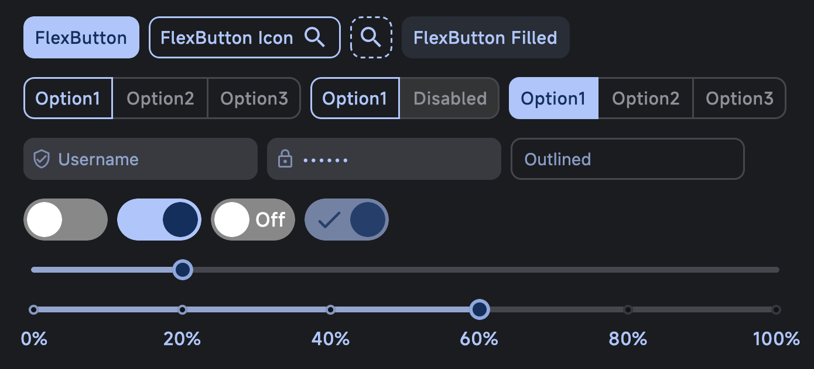

# Flex UI 组件库，基于 Kotlin Multiplatform

[](https://central.sonatype.com/search?q=cn.vividcode.multiplatform:flex-ui)
[](https://github.com/vividcodex/flex-ui/blob/master/README.md)
[](https://github.com/vividcodex/flex-ui/blob/master/LICENSE-2.0)


## 项目介绍

项目基于 Kotlin Multiplatform 多平台开发，致力于打造风格一致，美观的 UI 组件

## 多平台

支持的平台：Android | IOS | WasmJs | Js | Window | MacOS | Linux

## 最新变化

当前版本：1.0.0-exp-07

项目处于早期阶段

# 组件库

## 主题

- 使用 `FlexTheme` 主题以启用 FlexUI 的配置系统，以下为 FlexTheme 的方法定义

```kotlin
@Composable
fun FlexTheme(
	darkTheme: Boolean = isSystemInDarkTheme(),
	colorSchemes: ColorSchemes = DefaultColorSchemes,
	shapes: Shapes = MaterialTheme.shapes,
	typography: Typography = MaterialTheme.typography,
	flexConfig: FlexConfig = rememberFlexConfig(),
	content: @Composable () -> Unit,
)  
```

- 基于 Material3 的色彩管理方式，支持 `LocalDarkTheme.current` 获取是否是深色主题
- `FlexThemeState` 可以设置当前主题，例：`FlexThemeState.darkTheme = true`

## 类型

- 尺寸类型 `FlexSizeType` 分别为：ExtraSmall, Small, Medium, Large, ExtraLarge 5种尺寸类型
- 圆角类型 `FlexCornerType` 分别为：None, ExtraSmall, Small, Medium, Large, ExtraLarge, Circle 7种圆角类型
- 颜色类型 `FlexBrushType` 可使用 `data object` 实现 `FlexBrushType` 接口自行实现，默认提供：Primary, Secondary, Tertiary, Error, InverseSurface 5种 Material3 类型，
  以及 3种渐变类型 LinearGradient RadialGradient, SweepGradient

- 可全局配置不同组件类型也可以单独设置

## 配置

- 使用 `flexConfig` 或 `rememberFlexConfig` 用来配置所有组件的参数

## 预览



## FlexButton 按钮

## FlexRadio 单选框

## FlexInput 输入框

## FlexSwitch 开关

## FlexSlider 滑动条