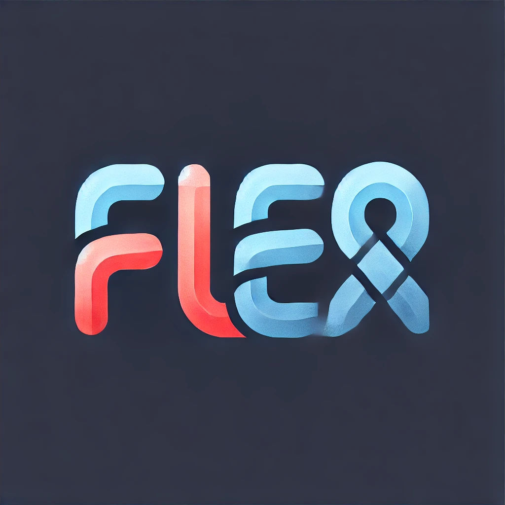
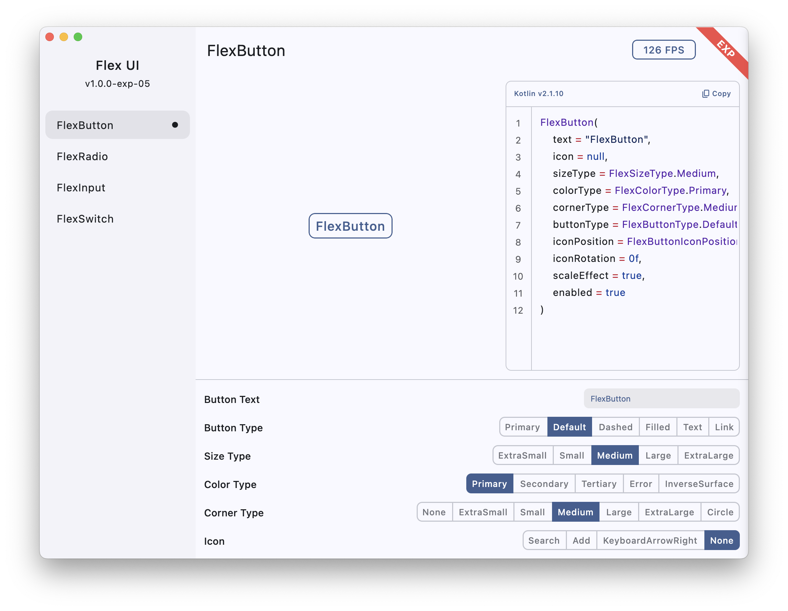
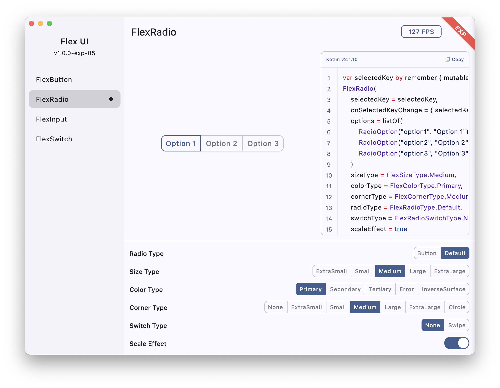
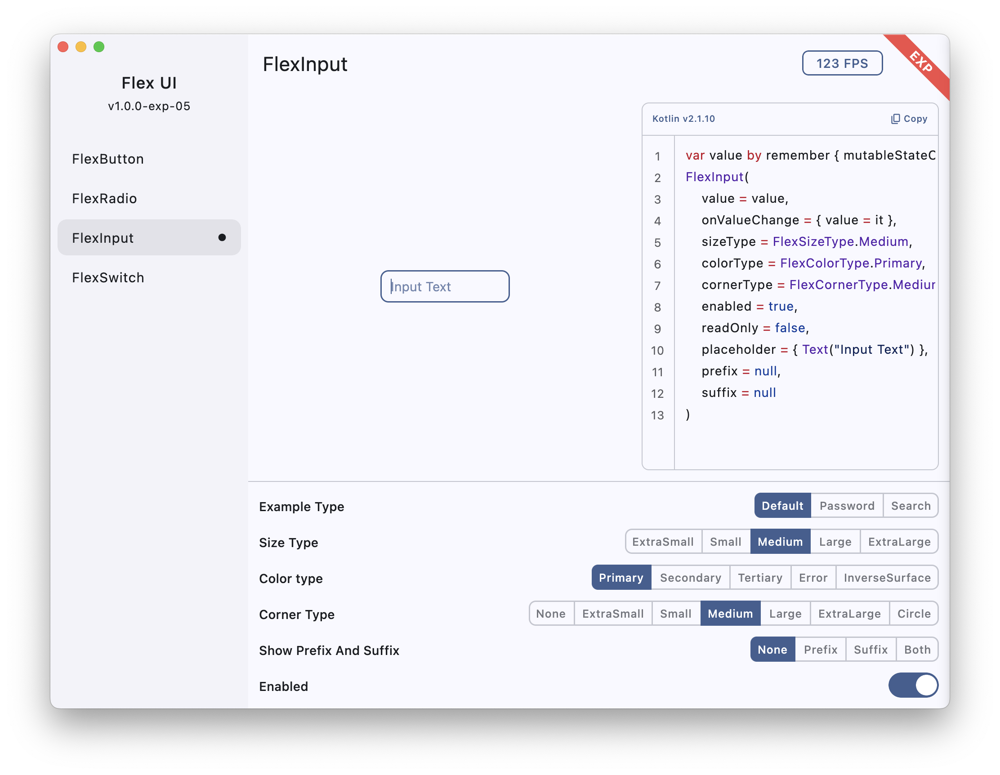
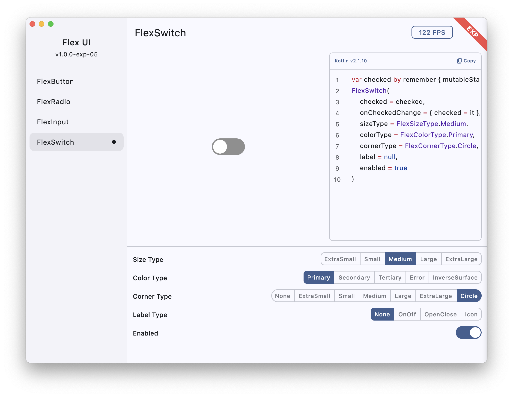

# Flex UI 组件库，基于 Kotlin Multiplatform

## 项目介绍

项目基于 Kotlin Multiplatform 多平台开发，致力于打造风格一致，美观的 UI 组件

## 多平台

支持的平台：Android | IOS | WasmJs | Js | Window | MacOS | Linux

## 最新变化

当前版本：1.0.0-exp-05

项目处于早期阶段

# 组件库

## 主题

- 可以配置不同颜色类型的颜色（深色模式、浅色模式）

## 类型

- 可以配置默认的：尺寸类型、圆角类型、颜色类型

- 所有控件均可以单独设置：尺寸类型、圆角类型、颜色类型

## FlexButton 按钮

## FlexRadio 单选框

## FlexInput 输入框

## FlexSwitch 开关

